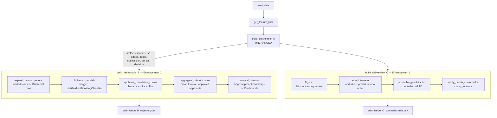

# Design Document

## Overview

This design specifies two enhancements to the existing `solution.py` pipeline for
the SMB Underwriting Challenge. Both are confined to `solution.py`; Deliverable A
code, output file names/locations, the dependency set (numpy/pandas/scikit-learn,
no OpenMP/GPU), and the `validate_submission.py` contract are all preserved.

**Enhancement 1 — Deeper Structural Causal Model (Deliverable C).** The current
SCM (`SCM_EDGES`) fits four structural equations and falls back to a
deterministic-ratio edit for everything else. We expand `SCM_EDGES` to **ten**
fitted structural equations spanning the bank-feed, bureau-credit, and
application-context groups, using parents drawn only from `data_dictionary.csv`
columns and keeping the DAG acyclic. The existing machinery —
abduction-action-prediction (`scm_intervene`), residual preservation,
`_topo_order`, the deterministic-ratio fallback (`_rescale_ratio`) with
divide-by-zero guards, and per-bin conformal widening — is reused unchanged in
structure. The expansion is purely additive: more children, more edges, same
algorithm. This preserves the no-op invariant (intervening to the current value
leaves PD unchanged within 1e-6) by construction.

**Enhancement 2 — Discrete-time hazard / survival model (Deliverable B).** The
current `estimate_timing_by_risk` / `build_deliverable_B` uses three empirical
PD-bucket timing curves and a PD-weighted mixture, scaling a single incidence
number by a shared timing shape. We replace the empirical bucketing with a
**feature-conditioned discrete-time hazard model**. Each labeled training loan is
expanded into person-period (discrete-time) rows over the 13 weekly age
intervals; a `HistGradientBoostingClassifier` predicts the conditional hazard
`h(a | features)` of first default in interval `a` given survival to `a`. Hazards
convert to a survival curve `S(a)` and cumulative-default curve `F(a) = 1 - S(a)`
per applicant. Each cohort's trajectory is the average of `F(a)` over its
approved applicants, so each cohort gets its own shape and level (riskier cohorts
default faster and more). Intervals propagate **both** timing-curve uncertainty
(bagged/bootstrapped hazard models) and incidence sampling uncertainty
(resampling the cohort's applicants).

Both enhancements keep the full run within the ~1–2 minute budget by reusing the
existing bagged HistGradientBoosting infrastructure and bounded ensemble sizes.

## Architecture

### Where the pieces fit into `main()`

The `main()` control flow is unchanged in shape:

```
main()
  load_data()                      # unchanged
  get_feature_lists(data_dict)     # unchanged
  build_deliverable_A(...)         # UNCHANGED (out of scope)
  build_deliverable_B(...)         # REWORKED -> discrete-time hazard survival model
  build_deliverable_C(...)         # REWORKED internals -> deeper SCM (same signature)
```



### Reused infrastructure (no behavioral change)

- `prepare_features`, `get_feature_lists`, `assign_cohort_week` — unchanged.
- `train_bagged_models` / `ensemble_predict` — the Deliverable A PD ensemble that
  scores counterfactual rows in C is reused as-is.
- `HistGradientBoostingClassifier` / `HistGradientBoostingRegressor` with the
  existing `CLF_PARAMS` / `REG_PARAMS` — the only learner engine.
- `_topo_order`, `_rescale_ratio`, `scm_intervene` — reused; only the `SCM_EDGES`
  data and the set of fitted children grow.
- `apply_perbin_conformal`, `tune_perbin_conformal`, `clamp_intervals` — reused
  for C interval widening and for B/C bound clamping (Req 9.6).

### Design rationale

- **Additive SCM expansion over a rewrite.** `scm_intervene` already implements
  Pearl's abduction-action-prediction with residual preservation and a
  topological re-simulation that is agnostic to the number of children. Growing
  `SCM_EDGES` automatically benefits every query whose feature is now an SCM
  parent, with zero change to the no-op guarantee.
- **Person-period (discrete-time) hazard over a parametric survival model.** The
  challenge restricts us to scikit-learn HistGradientBoosting. The person-period
  trick (Singer & Willett) turns survival estimation into a standard binary
  classification problem on expanded rows, so we can use the exact learner family
  already in the pipeline and inherit native NaN/categorical handling, while
  getting feature-conditioned, per-cohort timing shapes for free.

## Components and Interfaces

### Enhancement 1 — Deeper SCM (Deliverable C)

#### `SCM_EDGES` (expanded module-level constant)

A `dict[str, list[str]]` mapping each fitted child feature to its parent feature
list. Parents are exclusively `data_dictionary.csv` column names. See
**"Proposed SCM DAG Specification"** below for the full graph. Ten fitted
children replace the current four.

#### `fit_scm(train, categorical_cols) -> dict[str, (parents, regressor)]`

**Unchanged signature and body.** For each `child: parents` in `SCM_EDGES`:
fit a `HistGradientBoostingRegressor` on training rows where `child` is non-null,
skipping any child with fewer than 200 such rows (Req 1.5, 1.6). Because parents
are validated against the data dictionary at design time, and because
`prepare_features` reindexes to the requested columns, a parent name absent from
the data would surface as an all-NaN column rather than a crash (Req 1.3); the
design guarantees all configured parents exist in `data_dictionary.csv`.

#### `scm_intervene(row, feature, value, scm, categorical_cols) -> row`

**Unchanged body.** Three-step do-operator:
1. **Abduct** residuals `u_child = actual_child - reg.predict(original_parents)`
   for every fitted child whose observed value is numeric; children with
   missing/non-numeric observed values get `residuals[child] = None` and are left
   untouched (Req 2.4).
2. **Act**: set `row[feature] = value`.
3. **Predict**: in `_topo_order(SCM_EDGES)`, re-simulate each downstream child
   whose parent set intersects the changed-feature set as
   `reg.predict(new_parents) + u_child`, adding the child to the changed set
   (Req 2.1, 2.2). The deterministic engineered ratio
   `requested_amount_to_observed_revenue` is rescaled via `_rescale_ratio`
   (Req 2.6–2.8).

The no-op invariant holds because at `value == current`, step 3's
`reg.predict(new_parents)` equals step 1's `reg.predict(original_parents)`, so
`reg.predict(new_parents) + u_child == actual_child` for every child, and the
ratio rescale factor is 1.0 (Req 2.3, 3.1, 3.2).

#### `build_deliverable_C(...)` — unchanged structure

Same loop over `intervention_queries.csv`: fall back to a valid in-range row for
unknown applicants (Req 5.6), score the counterfactual row through the existing
ensemble + isotonic calibrator, apply per-bin conformal widening and
`clamp_intervals` (Req 5.7), write the four-column CSV (Req 5.1–5.5).

#### New diagnostic: `report_directional_effects(...)` (Req 4.3)

A lightweight, print-only helper invoked inside `build_deliverable_C` that, for
each query, compares `predicted_pd_cf` to the applicant's baseline PD and tallies
the share of upward / downward / near-zero (`|Δ| <= 1e-6`) movements. It writes
nothing to the submission; it only prints an aggregate so the team can confirm
directional correctness (Req 4.1, 4.2 are validated in testing, not enforced
per-row at runtime).

### Enhancement 2 — Discrete-time hazard survival model (Deliverable B)

#### `WEEK_BINS` / age intervals

Loan age `a in {1..13}`; interval `a` covers days `(7(a-1), 7a]`. A default with
`days_to_default = d` falls in interval `a = min(13, ceil(d / 7))`. Records with
`days_to_default` outside `[1, 90]` are excluded from estimation (Req 6.6).

#### `expand_person_periods(labeled, feature_cols) -> (X_pp, y_pp, age_pp)`

Expands each labeled training loan (rows where `default_flag` is non-null) into
discrete-time rows:
- **Defaulter** with event interval `a* = min(13, ceil(days_to_default/7))`:
  emit rows for `a = 1..a*`, with event `= 0` for `a < a*` and event `= 1` at
  `a*`. Rows for `a > a*` are omitted (the loan has left the risk set).
- **Non-defaulter** (matured, `default_flag == 0`): emit rows for `a = 1..13`,
  all event `= 0` (survived every interval in the observation window).

Each person-period row carries the loan's feature vector plus the integer age
`a` as an additional covariate (`loan_age_weeks`). Returns the stacked feature
frame `X_pp` (features + age column), the binary hazard target `y_pp`, and the
age vector.

#### `fit_hazard_models(X_pp, y_pp, categorical_cols, n_bag) -> list[clf]`

Fits `N_BAG_SURV` bagged `HistGradientBoostingClassifier`s on bootstrapped
person-period rows (resampling at the **loan** level to keep within-loan rows
together where practical, or row-level bootstrap as a simpler equivalent). The
age covariate is treated as numeric; categorical features use the existing
`categorical_features` mask. Each model predicts `h(a | x) = P(event=1 | x, a)`
(Req 6.1, 6.2, 6.5).

#### `applicant_cumulative_curve(model, X_app, categorical_cols) -> F (n_app x 13)`

For each applicant, build 13 covariate rows (one per age `a`), predict the hazard
vector `h = [h(1), ..., h(13)]`, then:
- `S(a) = prod_{k=1..a} (1 - h(k))`  (survival)
- `F(a) = 1 - S(a)`                  (cumulative default fraction)

`F` is non-decreasing in `a` and lies in `[0, 1]` because each `h(k) in [0, 1]`
(Req 6.3).

#### `aggregate_cohort_curves(F, cohort_week, approved) -> cohort_curves (13 x 13)`

For each cohort week `w`, average `F(a)` over approved applicants assigned to `w`
(via `assign_cohort_week`), yielding that cohort's `cumulative_default_rate`
trajectory. Empty cohorts fall back to the mean curve over all approved
applicants. Riskier cohorts (higher mean hazards) reach any given fraction of
their total defaults at an earlier age (Req 6.4).

#### `survival_intervals(...) -> (lo 13x13, hi 13x13)`

For `B = N_BOOT_SURV` iterations: (a) pick a bagged hazard model (timing-curve
uncertainty) and (b) resample the cohort's approved applicants with replacement
(incidence uncertainty), recompute the cohort curve, and collect per-`(w, a)`
distributions. Take the 5th/95th percentiles as `cdr_lower_90` / `cdr_upper_90`
(Req 7.1, 7.2).

#### `build_deliverable_B(artifacts, train, val, cohorts)` — reworked body

Orchestrates the components above, then enforces the output contract: per-cohort
`np.maximum.accumulate` on point and bounds (Req 8.5), `clamp_intervals(...,
floor_width=0.0)` to guarantee ordered, in-range bounds (Req 7.3, 8.4), integer
`cohort_week` / `loan_age_weeks` (Req 8.6), and writes the 169-row CSV to
`submission/submission_B_trajectory.csv` (Req 8.1–8.3).

#### New constants

```python
N_BAG_SURV = 8       # bagged hazard models (timing-curve uncertainty)
N_BOOT_SURV = 200    # cohort applicant resamples (incidence uncertainty)
N_AGE_WEEKS = 13     # discrete intervals
DTD_MIN, DTD_MAX = 1, 90
```

## Data Models

### SCM structural equation entry

```
SCM_EDGES: dict[child_name: str, parent_names: list[str]]
fitted SCM: dict[child_name: str, (parents: list[str], reg: HistGradientBoostingRegressor)]
```

### Person-period row (Deliverable B intermediate)

| Column            | Type    | Meaning                                        |
|-------------------|---------|------------------------------------------------|
| `<feature_cols>`  | float   | loan feature vector (NaN preserved)            |
| `loan_age_weeks`  | int     | discrete interval `a in {1..13}` (covariate)   |
| `event`           | int 0/1 | first-default-in-interval indicator (target)   |

### Cohort trajectory grid (Deliverable B output — unchanged schema)

| Column                   | Type  | Range / rule                          |
|--------------------------|-------|---------------------------------------|
| `cohort_week`            | int   | 1..13                                 |
| `loan_age_weeks`         | int   | 1..13                                 |
| `cumulative_default_rate`| float | `[0,1]`, non-decreasing within cohort |
| `cdr_lower_90`           | float | `[0,1]`, `<= cumulative_default_rate` |
| `cdr_upper_90`           | float | `[0,1]`, `>= cumulative_default_rate` |

169 rows = 13 × 13.

### Counterfactual output (Deliverable C — unchanged schema)

| Column            | Type  | Range / rule                       |
|-------------------|-------|------------------------------------|
| `query_id`        | str   | one per `intervention_queries.csv` |
| `predicted_pd_cf` | float | `[0,1]`                            |
| `pd_cf_lower_90`  | float | `[0,1]`, `<= predicted_pd_cf`      |
| `pd_cf_upper_90`  | float | `[0,1]`, `>= predicted_pd_cf`      |

## Proposed SCM DAG Specification

All children are fitted with a `HistGradientBoostingRegressor`; all parents are
`data_dictionary.csv` columns. Exogenous roots (never children here) are
business-identity and self-reported fundamentals: `stated_annual_revenue`,
`sector`, `employee_count_bucket`, `vintage_years`, `stated_time_in_business`,
`requested_amount`, `owner_personal_credit_band`, `application_channel`,
`days_since_last_inquiry_elsewhere`, `days_since_last_external_decline`.

### Bank-feed group (6 fitted children)

| Child | Parents | Economic justification |
|-------|---------|------------------------|
| `observed_monthly_revenue_avg_3mo` | `stated_annual_revenue`, `sector`, `employee_count_bucket`, `vintage_years`, `stated_time_in_business` | Observed bank cash-in tracks self-reported scale, industry, firm size and maturity. |
| `observed_revenue_volatility` | `sector`, `vintage_years`, `employee_count_bucket`, `observed_monthly_revenue_avg_3mo` | Volatility is driven by industry seasonality, firm age/size, and revenue level. |
| `observed_revenue_trend_3mo` | `observed_monthly_revenue_avg_3mo`, `observed_revenue_volatility`, `sector`, `vintage_years` | Recent trend depends on level, noise, sector cycle, maturity. |
| `observed_cash_balance_p10` | `observed_monthly_revenue_avg_3mo`, `observed_revenue_volatility`, `existing_debt_obligations`, `requested_amount` | Low-percentile liquidity falls with debt service and loan size, rises with revenue, shrinks with volatility. |
| `payroll_regularity_score` | `observed_monthly_revenue_avg_3mo`, `observed_revenue_volatility`, `employee_count_bucket`, `vintage_years` | Payroll regularity reflects revenue stability, headcount, and maturity. |
| `observed_overdraft_count_3mo` | `observed_cash_balance_p10`, `observed_revenue_volatility`, `payroll_regularity_score` | Overdrafts increase as buffer liquidity falls, volatility rises, and payroll becomes irregular. |

### Bureau-credit group (3 fitted children)

| Child | Parents | Economic justification |
|-------|---------|------------------------|
| `existing_debt_obligations` | `stated_annual_revenue`, `employee_count_bucket`, `vintage_years`, `owner_personal_credit_band` | Debt capacity scales with revenue/size/maturity and the owner's credit standing. |
| `recent_inquiries_count_6mo` | `multi_lender_inquiry_count_30d`, `owner_personal_credit_band`, `days_since_last_external_decline` | Bureau inquiries reflect recent shopping behavior, credit band, and recent declines. |
| `aggregate_credit_utilization` | `existing_debt_obligations`, `owner_personal_credit_band`, `stated_annual_revenue`, `recent_inquiries_count_6mo` | Utilization rises with debt and inquiry pressure, moderated by credit band and revenue capacity. |

### Application-context group (1 fitted child)

| Child | Parents | Economic justification |
|-------|---------|------------------------|
| `multi_lender_inquiry_count_30d` | `application_channel`, `days_since_last_inquiry_elsewhere`, `owner_personal_credit_band` | Near-simultaneous multi-lender shopping varies by acquisition channel, recency of prior shopping, and credit standing. |

### Deterministic engineered child (not fitted)

`requested_amount_to_observed_revenue` remains deterministic, rescaled by
`_rescale_ratio` from `requested_amount` and `observed_monthly_revenue_avg_3mo`
under intervention (Req 2.6–2.8).

### Acyclicity

Child-to-child dependencies:
`MR -> {VOL, TREND, CASH, PAY}`, `VOL -> {TREND, CASH, PAY, OD}`,
`DEBT -> {CASH, UTIL}`, `CASH -> OD`, `PAY -> OD`, `MULTI -> INQ`, `INQ -> UTIL`.

A valid topological order (parents before children):
`MR, DEBT, MULTI -> VOL, INQ -> TREND, PAY, UTIL, CASH -> OD`.
No back-edges exist, so the graph is acyclic and `_topo_order` returns a single
covering order (Req 1.4). This DAG is regulator-defensible: business fundamentals
drive observed bank-feed signals; debt and credit band drive utilization; shopping
behavior drives bureau inquiries — no reverse-causal or circular edges.

## Data Flow

### Deliverable C (per query)

```
query (applicant_id, feature_name, value)
  -> baseline row from artifacts["submission"]
  -> scm_intervene: abduct residuals -> set feature -> re-simulate descendants (topo) -> rescale ratio
  -> prepare_features -> ensemble_predict -> isotonic calibrate -> predicted_pd_cf
  -> apply_perbin_conformal(edges, deltas) -> clamp_intervals
  -> row (query_id, predicted_pd_cf, pd_cf_lower_90, pd_cf_upper_90)
```

### Deliverable B (whole grid)

```
labeled train loans
  -> expand_person_periods -> (X_pp, y_pp with age covariate)
  -> fit_hazard_models (N_BAG_SURV bagged classifiers)
submission applicants (approved)
  -> applicant_cumulative_curve per model -> F(a) per applicant
  -> aggregate_cohort_curves -> 13x13 point trajectory
  -> survival_intervals (bag x applicant bootstrap) -> 13x13 lo/hi
  -> per-cohort maximum.accumulate (point, lo, hi) -> clamp_intervals
  -> 169-row submission_B_trajectory.csv
```

## Correctness Properties

*A property is a characteristic or behavior that should hold true across all valid
executions of a system — essentially, a formal statement about what the system
should do. Properties serve as the bridge between human-readable specifications and
machine-verifiable correctness guarantees.*

These properties were derived from the acceptance-criteria prework. Per-row output
bound/ordering criteria (5.4/5.5, 7.3, 8.4) were consolidated because they all
reduce to invariants of the shared `clamp_intervals` output. The no-op criteria
(2.3, 3.1, 3.2) consolidate into a single invariance property. The two directional
criteria (4.1, 4.2) combine into one signed-direction property. The cumulative-curve
criteria (6.3, 8.5) combine into one monotone-bounded property. Configuration,
dependency, file-output, and runtime criteria are validated by smoke/integration
tests (see Testing Strategy), not as properties.

### Property 1: No-op intervention invariance

*For any* applicant in the scored submission set and *any* intervenable feature,
applying `do(feature = current_value)` SHALL leave the resulting counterfactual PD
equal to the applicant's pre-intervention PD within `1e-6`, and SHALL leave every
fitted child feature value equal to its pre-intervention value within `1e-6`.

**Validates: Requirements 2.3, 3.1, 3.2**

### Property 2: DAG acyclicity and topological ordering

*For any* `SCM_EDGES` configuration, `_topo_order` SHALL return an ordering that
includes every fitted child exactly once and places every parent that is itself a
fitted child before that child (no cycles, parents-before-children), so that
intervention re-simulation processes descendants in a valid causal order.

**Validates: Requirements 1.4, 2.1**

### Property 3: Engineered-ratio rescale correctness

*For any* non-null stored ratio `r_old` and *any* strictly positive inputs
`amt_old, amt_new, rev_old, rev_new`, `_rescale_ratio` SHALL return
`r_old * (amt_new / amt_old) * (rev_old / rev_new)`; in particular when
`amt_new == amt_old` and `rev_new == rev_old` the factor SHALL equal 1.0 and the
ratio SHALL be unchanged.

**Validates: Requirements 2.6**

### Property 4: Directional correctness of counterfactual effects

*For any* set of applicants and *any* intervenable feature with a known monotone
risk direction, intervening to a value worse than each applicant's current value
(higher risk) SHALL produce a mean counterfactual PD greater than or equal to the
mean baseline PD, and intervening to a value better than current (lower risk) SHALL
produce a mean counterfactual PD less than or equal to the mean baseline PD.

**Validates: Requirements 4.1, 4.2**

### Property 5: Hazard vector validity

*For any* applicant feature vector, the fitted Survival_Model SHALL produce exactly
13 conditional hazard values (one per loan-age interval `a in {1..13}`), each in
`[0, 1]`.

**Validates: Requirements 6.1**

### Property 6: Cumulative-curve monotonicity and bounds

*For any* hazard vector `h in [0, 1]^13`, the derived cumulative default fraction
`F(a) = 1 - prod_{k=1..a} (1 - h(k))` SHALL be monotonically non-decreasing in `a`
and SHALL satisfy `F(a) in [0, 1]` for every `a`; consequently every written cohort
trajectory is non-decreasing across loan age within the cohort.

**Validates: Requirements 6.3, 8.5**

### Property 7: Cohort timing dominance

*For any* two hazard vectors `h_A` and `h_B` with `h_A(k) >= h_B(k)` for every
interval `k`, the cumulative default fraction `F_A(a) >= F_B(a)` for every age `a`;
therefore for any target fraction in `(0, 1]` of total cumulative defaults, the
higher-hazard (riskier) cohort reaches that fraction at a loan age no later than the
lower-hazard cohort.

**Validates: Requirements 6.4**

### Property 8: Interval ordering after calibration

*For any* point estimate and lower/upper bounds passed through the conformal
widening and `clamp_intervals`, the output SHALL satisfy
`lower <= point <= upper` (applies to every Deliverable C row and every Deliverable
B grid cell).

**Validates: Requirements 5.5, 7.3**

### Property 9: Output values within the unit interval

*For any* point estimate and bounds passed through `clamp_intervals`, the output
point, lower, and upper values SHALL all lie within `[0, 1]` (applies to every
Deliverable C row and every Deliverable B grid cell).

**Validates: Requirements 5.4, 8.4**

## Error Handling

| Condition | Handling | Requirement |
|-----------|----------|-------------|
| Child has fewer than 200 non-null training rows | Omit that structural equation from the fitted SCM; continue with the rest | 1.6 |
| Configured parent not in data dictionary (defensive) | `prepare_features` reindex yields an all-NaN column; HistGB tolerates it; design guarantees no such parent exists | 1.3 |
| Applicant's observed child value missing/non-numeric | Set `residuals[child] = None`; skip re-simulation of that child (leave unchanged) | 2.4 |
| Ratio rescale input zero / missing / non-numeric | Guard in `_rescale_ratio` omits that factor contribution; no division performed | 2.7 |
| Stored engineered ratio is NaN | `_rescale_ratio` returns it unchanged | 2.8 |
| Query references unknown applicant | Emit a valid in-range fallback row `(0.5, 0.4, 0.6)` | 5.6 |
| `days_to_default` outside `[1, 90]` | Exclude record from person-period expansion | 6.6 |
| Defaulter with NaN `days_to_default` | Excluded from defaulter timing; treated per existing labeled-row rules | 6.6 |
| Empty cohort (no approved applicants) | Fall back to mean cumulative curve over all approved applicants | 6.3, 8.2 |
| Interval lower/upper collapse or invert | `clamp_intervals` re-orders and clips to `[0,1]`; `maximum.accumulate` enforces per-cohort monotonicity before clamping | 5.5, 7.3, 8.4, 8.5 |
| Hazard prediction slightly outside `[0,1]` (numerical) | Clip hazards to `[0,1]` before survival product | 6.1, 6.3 |

All `numpy`/`pandas` numeric coercion uses `pd.to_numeric(..., errors="coerce")`,
consistent with the existing pipeline, so non-numeric cells become NaN rather than
raising.

## Testing Strategy

### Approach

A dual approach: **property-based tests** for the universally-quantified invariants
above, and **example / edge-case / integration / smoke tests** for the remaining
acceptance criteria. Tests live alongside the pipeline (e.g. `test_solution.py`) and
use only the allowed dependencies plus a property-based testing library
(**Hypothesis** for Python). Tests that require a fitted model operate on a small
synthetic frame or a cached subsample to stay within the runtime budget; the
heaviest validation (full pipeline + validator PASS) runs once as an integration
test.

### Property-based tests

- Use **Hypothesis** (`pip install hypothesis`); do not hand-roll generators where
  the library suffices.
- Each property test runs a **minimum of 100 iterations**
  (`@settings(max_examples=100)` or more).
- Each property test is tagged with a comment in the format:
  `# Feature: causal-and-survival-upgrades, Property {n}: {property_text}`.
- Each correctness property maps to a **single** property-based test:
  - **P1 No-op invariance** — generator: random applicant index + random intervenable
    feature; assert `|pd_cf - pd_base| <= 1e-6` and all child deltas `<= 1e-6`.
    (Run against a small fitted SCM on a subsample for speed.)
  - **P2 DAG order** — generator: random acyclic edge subsets (plus the real
    `SCM_EDGES`); assert `_topo_order` lists each child once and parents precede
    children; a generated cyclic graph is asserted to be rejected/detected.
  - **P3 Ratio rescale** — generator: random `r_old` and positive `amt/rev` quadruples;
    assert the returned value equals the formula, and equals `r_old` at equal inputs.
  - **P4 Directional correctness** — generator: random subset of applicants for a
    risk-signed feature; assert the aggregated inequality holds (allowing a small
    tolerance and aggregation across applicants to absorb model noise).
  - **P5 Hazard validity** — generator: random feature rows; assert 13 hazards each in
    `[0,1]`.
  - **P6 Cumulative-curve** — generator: random `h in [0,1]^13`; assert `F` is
    non-decreasing and within `[0,1]`.
  - **P7 Timing dominance** — generator: random `h_B` and a nonneg increment to form
    `h_A >= h_B`; assert `F_A(a) >= F_B(a)` for all `a`.
  - **P8 Interval ordering** — generator: random `(point, lo, hi)` triples (including
    inverted/out-of-range); assert `clamp_intervals` output satisfies `lo<=pt<=hi`.
  - **P9 Bounds** — same generator as P8; assert all three outputs in `[0,1]`.

### Example and edge-case tests

- **2.5** intervene on a non-SCM feature → only the deterministic-ratio path runs.
- **6.2** two materially different risk profiles → timing shapes differ in ≥1 interval.
- **9.6 / 5.7** conformal widening still invoked for A/B/C bounds.
- Edge cases: **1.3** bogus parent tolerated; **1.6** thin child omitted; **2.4** NaN
  child not propagated; **2.7** zero/NaN ratio inputs guarded; **2.8** NaN ratio
  unchanged; **5.6** unknown applicant fallback row; **6.6** out-of-window
  `days_to_default` excluded.

### Integration and smoke tests

- **9.1 validator PASS (integration):** run `python solution.py` then
  `python validate_submission.py ./submission`; assert the process prints `PASS`
  and exits 0.
- **5.1/5.2/8.1/8.2 output contract (integration):** assert both CSVs exist, C has
  one row per `query_id` (900), B has 169 rows covering the full 13×13 grid.
- **1.1/1.2 SCM structure (smoke):** assert fitted SCM has ≥8 children, ≥1 per group
  (bank_feed, bureau_credit, application_context) using `data_dictionary.csv`, and
  every parent is a data-dictionary field.
- **8.6 integer grid / 8.3 / 5.3 schema (smoke):** assert column names and integer
  dtypes for `cohort_week` / `loan_age_weeks`.
- **9.2 (smoke):** assert `submission_A_decisions.csv` path unchanged and A code
  untouched.
- **9.3 runtime (smoke):** time the full run; assert it completes within ~2 minutes.
- **9.4/1.7/6.5 dependencies (smoke):** assert only numpy/pandas/sklearn (plus the
  test-only Hypothesis) are imported by `solution.py`.
- **9.5 (smoke):** confirm `git diff` touches only `solution.py`.

### How the key invariants are verified

- **No-op invariant (Req 3):** Property 1 with `value == current` across random
  applicants/features; this is the primary regression guard for the SCM expansion.
- **Directional correctness (Req 4):** Property 4 aggregated test, plus the runtime
  directional-effects diagnostic (Req 4.3) printed during `build_deliverable_C`.
- **Monotonicity (Req 6.3, 8.5):** Property 6 at the hazard→F level, plus the
  validator's own non-monotone-cohort check as an end-to-end backstop.
- **Validator PASS (Req 9.1):** the integration test is the authoritative gate; all
  bound/ordering/grid properties feed into it.
