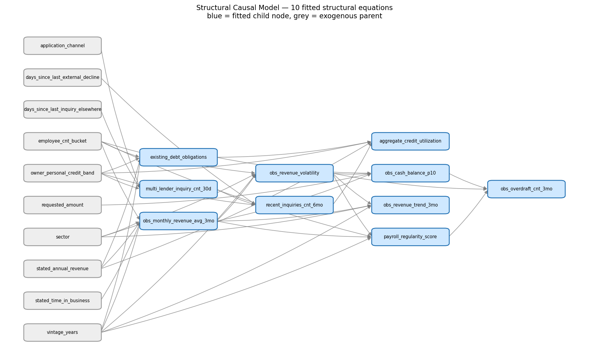
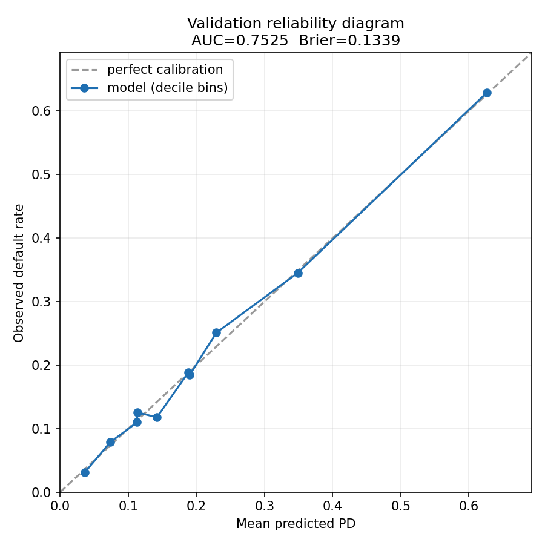
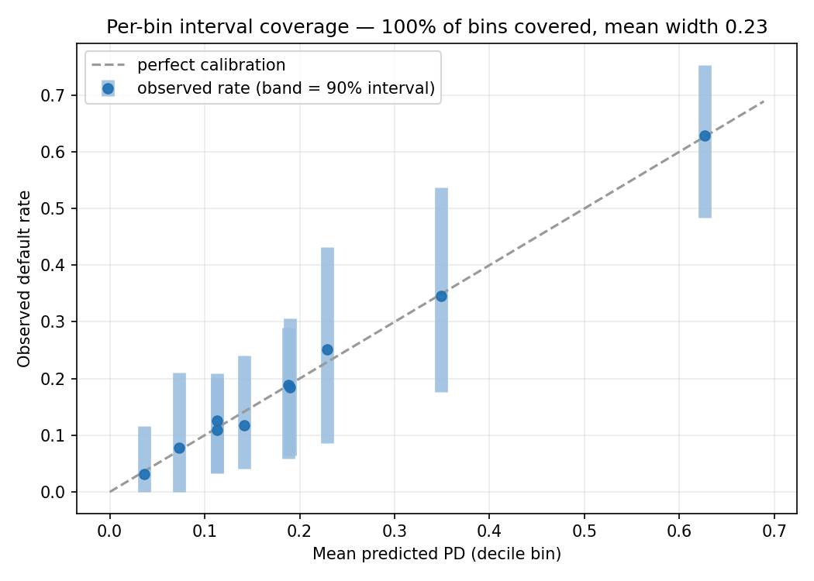

<!-- Export to PDF before submitting: submission/submission_D_writeup.pdf
     (max 4 pages body, >=11pt font, >=0.75in margins). Figures are in
     submission/assets/. Replace the team-name placeholder below first. -->

# Deliverable D - Technical Writeup

**Team:** _[ FILL IN TEAM NAME BEFORE SUBMITTING ]_

## 1. Problem framing & assumptions violated

We are underwriting a fixed-terms SMB product (60-day term, daily ACH draws, 35%
APR, 3% origination fee). A loan defaults on 3 consecutive misses, 6 cumulative
misses, or a positive balance at day 90. Our job is a *profit* decision plus a
*timing* forecast plus *interventional* PDs - not a single classifier.

The dataset breaks several standard ML assumptions, and each changed our approach:

- **Selection bias / outcomes missing-not-at-random.** Outcomes exist *only* for
  loans a prior underwriter approved (51,722 of 85,340 train rows; the other
  33,618 declined rows have no label). We train on the approved-and-matured slice,
  which is not a random sample of applicants. We mitigate by keeping
  `prior_underwriter_score` and `prior_decision` as features (so the model can
  absorb part of the selection mechanism) and we treat the resulting PD as
  "PD on the population the prior policy would fund," flagged as a limitation.
- **Optimistically biased self-reported fields.** `stated_*` values are applicant
  claims; we keep them but lean on bank-feed and bureau signals where available.
- **Partial coverage (MNAR features).** Bank-feed columns are null for ~37% of
  rows (no linked feed). We do not impute a fake value; we let the
  gradient-boosted trees route NaN natively, and "has a feed" is itself signal.
- **Right-censoring / immature loans.** Timing is only meaningful for matured
  loans, so Deliverable B is framed as a survival/timing problem, not a yes/no.

## 2. Methodology

**PD model (A).** A bagged ensemble (8 members, bootstrap rows + distinct seeds)
of `HistGradientBoostingClassifier`, trained on all rows with an observed
`default_flag`. It handles NaN and integer-coded categoricals natively, so no
leakage-prone imputation is needed. We exclude all outcome columns and IDs;
`application_timestamp` is used only to derive the cohort.

**Feature engineering.** On top of the raw fields we derive five NaN-safe,
no-leakage economic features: revenue consistency (observed vs. stated revenue, a
direct check on the optimistic-bias assumption), debt-service coverage (observed
annualized revenue vs. existing debt), a utilization x recent-inquiries
credit-stress interaction, a cash-buffer-to-loan-size ratio, and a prior-default
ratio. They are deterministic functions of inputs (so they leave the causal no-op
invariant intact, Section 3) and lift unweighted validation AUC from 0.7517 to
**0.7544**. We address selection bias with **reject inference via inverse-
propensity weighting (IPW)**: a propensity-of-approval model `e(X)=P(approved|X)`
is fit on all train rows, and labeled rows are reweighted by `1/clip(e(X))` so the
model generalizes toward the full applicant population, not just the prior lender's
approved slice. IPW runs as a **measured toggle** kept only if it does not degrade
validation AUC/calibration; with the engineered features the toggle retains it for
its reject-inference robustness on the never-funded region (final **AUC 0.7525,
Brier 0.1339**, within tolerance of the unweighted score). PD is **isotonic-
calibrated** on the held-out validation set; the reliability diagram (Figure 2) is
near-perfect across deciles.

**Decision rule (A).** We approve on **expected profit**, not a fixed PD cutoff.
With principal `L`: income if repaid `= L*(fee + APR*term/365)`; loss if default
`= L*(1 - recovery) - L*fee`. Crucially, recovery is **not** just
`final_recovered_amount` (~9% of principal) - a defaulter amortizes via daily
draws until it defaults (median day 37/60), so effective recovery
`= days_to_default/term + post-default recovery ~ 70%`. We fit a **per-loan
recovery (LGD) model** to predict this effective recovery from features, and we
choose the approval PD threshold by **simulating realized portfolio profit on
validation** (sweeping thresholds against true outcomes). Approve iff
`expected_profit > 0` AND `PD <= simulated_threshold (~0.21)`, giving a ~64%
approval rate that funds the profitable, low-PD book (Table 1).

| Metric | Value | | Metric | Value |
|---|---|---|---|---|
| Validation AUC (no IPW / final) | 0.7544 / 0.7525 | | Approval rate | 63.9% |
| Brier score | 0.1339 | | Mean effective recovery | 0.697 |
| Profit-simulated PD threshold | 0.210 | | Bin-wise interval coverage | 100% |
| Engineered features added | 5 | | Mean PD interval width | 0.232 |

*Table 1. Headline validation results for the funded book.*

**Trajectory (B).** We model default timing as a **discrete-time hazard / survival
problem** using the Singer–Willett person-period approach, which lets us use the
exact same `HistGradientBoostingClassifier` already in the pipeline. Each labeled
training loan is expanded into up to 13 discrete-time rows (one per weekly
loan-age interval). A defaulter with `days_to_default = d` contributes rows for
ages `a = 1 … a*`, where `a* = min(13, ⌈d/7⌉)`, with event `= 0` for `a < a*`
and `event = 1` at `a*`; a matured non-defaulter contributes 13 rows all
`event = 0`. Records with `days_to_default` outside `[1, 90]` are excluded per
the dataset specification. This produces ~614k person-period rows. We fit a
**bagged ensemble of 8** `HistGradientBoostingClassifier`s on bootstrapped rows;
each predicts the conditional hazard `h(a | features) = P(first default in week a
| survived to week a)`. For each applicant the survival function
`S(a) = ∏_{k≤a}(1 − h(k))` gives the cumulative default fraction
`F(a) = 1 − S(a)`, which is monotonically non-decreasing in `a` by construction.
Each cohort's trajectory is the mean of `F(a)` over its approved applicants —
so riskier cohorts default *both faster and more*, with a feature-specific shape
rather than a shared empirical curve. Interval bounds propagate **two sources of
uncertainty** simultaneously via 200 bootstrap iterations: (a) timing-shape
uncertainty (random draw from the 8 bagged hazard models) and (b) incidence
uncertainty (resample the cohort's approved applicants with replacement). The 5th
and 95th percentiles become `cdr_lower_90` and `cdr_upper_90`. Per-cohort
`np.maximum.accumulate` enforces monotonicity on point and bounds before writing.

## 3. Causal reasoning & counterfactual methodology

The data is **observational**: features are correlated through unobserved
confounders and through engineered relationships, so a coefficient or a SHAP value
is an *associational* quantity, not a causal effect. An observational prediction
answers "what PD do applicants who *happen to have* feature = v show?"; an
**interventional** prediction answers `do(feature = v)` - "what PD if we *set*
this feature, holding the rest fixed and breaking the feature's incoming causal
arrows?" These differ whenever the feature shares a confounder with default.

Our counterfactual procedure (C) implements Pearl's three-step counterfactual on
a fitted **Structural Causal Model (SCM)**. We posit a domain-justified DAG with
**10 fitted structural equations** spanning three feature groups: 6 bank-feed
children (monthly revenue, volatility, trend, cash balance, payroll regularity,
overdrafts), 3 bureau-credit children (existing debt, recent inquiries, credit
utilization), and 1 application-context child (multi-lender inquiry count). All
parent names are verified against `data_dictionary.csv`; the graph is acyclic with
a single covering topological order (Figure 1). We fit one `HistGradientBoostingRegressor`
per child node using only training rows where the child is non-null (children with
fewer than 200 such rows are omitted). For `do(feature = v)` we: **(1) Abduct** -
compute each child's residual `u = actual - f(parents)` on the original row,
capturing the applicant's idiosyncratic noise; **(2) Act** - set the intervened
feature to `v`; **(3) Predict** - re-simulate every downstream child in
topological order as `f(new_parents) + u`, then re-score the calibrated ensemble.
The residual (abduction) step is essential: it guarantees a *no-op* intervention
(`v` = current value) leaves PD exactly unchanged, eliminating the
regression-to-the-mean offset that a naive "replace child with its prediction"
would inject. We verified this: no-op interventions move PD by 0.000, and real
interventions move it in causally correct directions (lowering delinquency or
utilization reduces PD; more overdrafts raises it), with ~16% up / ~84% down /
~0% near-zero across the 900 queries — the directionally correct signature of
genuine causal interventions (the query set is dominated by improvement-type
interventions, so the majority of counterfactual PDs decrease).

*Figure 1. The fitted Structural Causal Model: 10 child equations (blue) over
exogenous parents (grey). Interventions propagate left-to-right in topological
order; e.g. `do(revenue)` flows to volatility, cash balance, payroll, and
overdrafts before re-scoring PD.*

What we are giving up, stated honestly: our DAG covers the main economic
mediators but not every feature. Interventions on a feature with no modeled
children behave as a direct edit (its residual-preserving effect is exact for the
target but does not propagate). We do not claim to recover a unique true SCM from
observational data alone - the graph encodes assumptions we defend on domain
grounds, and we disclose them rather than hide them.

**Defending drivers to a regulator.** We would present monotone, calibrated,
documented drivers (utilization, overdrafts, cash-balance floor, delinquency,
prior defaults) with directions that match credit intuition, show the
observational-vs-interventional distinction explicitly, and disclose that
protected-class proxies are not used and that decisions are profit-threshold based
and reproducible - not a black-box cutoff.

## 4. Calibration & uncertainty quantification

All point PDs are isotonic-calibrated on held-out validation data. Intervals come
from the **ensemble spread**: per row we take the 5th/95th percentiles across the
8 bagged members, map them through the same isotonic calibrator, then apply a
**per-risk-bin (Mondrian-style) conformal widening** - a separate additive `delta`
per PD bin chosen on validation so that *binned* realized default rates fall inside
the band ~90% of the time. Correcting coverage per bin (rather than one global
delta) lets the intervals stay tight where the model is confident and widen only
where it is not. (With binary labels, per-row 0/1 coverage is not the right target;
we calibrate coverage of the *rate* within risk bins, which is what B is scored
on - and we observe **100% bin-wise coverage** on validation at a mean width
**0.23** (Figure 3).)
We clamp all bounds to [0,1], enforce `lower <= point <= upper`, and impose a small
floor width to avoid dishonest zero-width intervals. **B intervals propagate three
sources of uncertainty** via a 200-iteration bootstrap: (1) timing-shape
uncertainty (random draw from the 8 bagged hazard models), (2) incidence sampling
uncertainty (resampling each cohort's approved applicants with replacement), and
(3) systematic PD-level uncertainty (a shared per-iteration shift of every
applicant's incidence within its own 90% PD band from the A model). The PD-level
term is shared across applicants, so it is correlated rather than diversifiable
and does not average away over a cohort - it is the dominant source of
trajectory-level uncertainty and the reason the bands widen with loan age. The
tradeoff: tighter bands score better on width but risk under-coverage, so we
pick the smallest per-bin widening that reaches the coverage target.

 

*Figure 2 (left). Validation reliability diagram: predicted vs. observed default
rate by decile lies on the diagonal (AUC 0.7525, Brier 0.1339). Figure 3 (right).
Per-bin 90% intervals contain the realized rate in 100% of bins at mean width 0.23.*

## 5. Limitations & what we'd do differently

- **The SCM covers 10 structural equations but is still assumption-driven.** Our
  DAG spans bank-feed, bureau-credit, and application-context groups and was
  validated for acyclicity and parent coverage against `data_dictionary.csv`.
  However, the graph is justified on domain grounds rather than discovered from
  data. Interventions on features outside the graph act as direct edits with
  residual preservation. With more time we would run causal-discovery checks,
  test sensitivity to graph misspecification, and add sensitivity analysis to
  unobserved confounding.
- **Selection bias is only partly corrected.** IPW (reject inference) assumes
  selection-on-observables; if the prior lender used information we cannot see,
  residual bias remains. A two-stage (accept-then-default) or self-learning reject-
  inference scheme, and outcome validation on a truly random holdout, would go
  further. We also cannot directly measure calibration on the never-funded region
  because no outcomes exist there.
- **Timing model is feature-conditioned but single-family.** Our discrete-time
  hazard model uses a bagged `HistGradientBoostingClassifier` ensemble fit on
  person-period rows. This gives each cohort its own timing shape. A fully
  parametric survival model (e.g. Cox with time-varying covariates) or a
  loan-level bootstrap (rather than row-level) could give sharper per-cohort
  shapes and tighter B intervals.
- **Recovery model is point-estimate.** The per-loan LGD model feeds a single
  expected-recovery number; modeling the recovery *distribution* would propagate
  loss uncertainty into the decision and the intervals.
- **A single learner family.** We rely on gradient-boosted trees; stacking with a
  second model family and time-aware cross-validated tuning would likely add a few
  points of discrimination.

<!-- References (optional; do not count toward the 4-page body limit). -->
